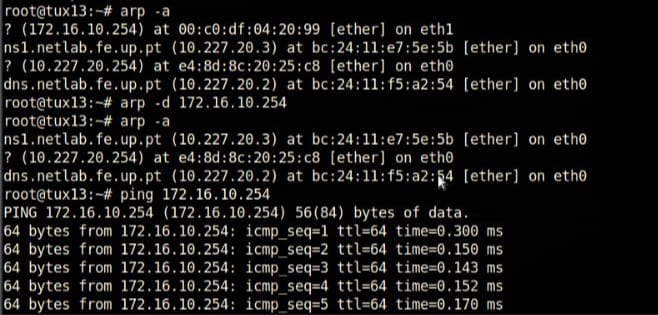
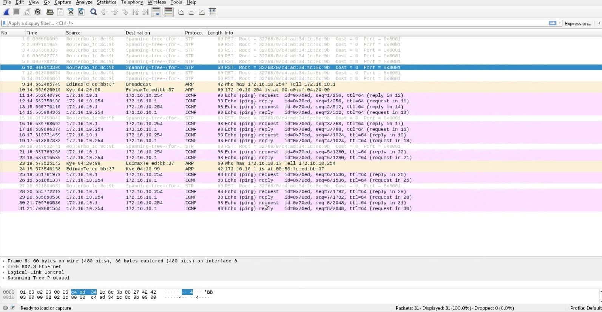

# Steps

## 2
- use `ifconfig` and `route` commands

```bash
ifconfig eth1 172.16.10.1/24
tux13 eth1 172.16.10.1/24
```

```bash
ifconfig eth1 172.16.10.254/24
tux14 eth1 172.16.10.254/24
```
```bash
route -n
| Destination | Gateway |
| 10.277.20.0 | 0.0.0.0 |
| 172.16.10.0 | 0.0.0.0 |
```
## 3
- TUX13

    IP -> 172.16.10.1/24  
    MAC -> 00:50:fc:ed:bb:37


- TUX14

    IP -> 172.16.10.254    
    MAC -> 00:c0:df:04:20:99

## 4
```bash
root@tux13:~# ping 172.16.10.254
PING 172.16.10.254 (172.16.10.254) 56(84) bytes of date 
64 bytes from 172.16.10.254: icmp_seq=1 ttl=64 time=0.119ms
64 bytes from 172.16.10.254: icmp_seq=1 ttl=64 time=0.112ms
64 bytes from 172.16.10.254: icmp_seq=1 ttl=64 time=0.097ms
64 bytes from 172.16.10.254: icmp_seq=1 ttl=64 time=0.111ms
64 bytes from 172.16.10.254: icmp_seq=1 ttl=64 time=0.093ms
(...)
```


## 5
route -n:

```bash
route -n
| Destination | Gateway |
| 10.277.20.0 | 0.0.0.0 |
| 172.16.10.0 | 0.0.0.0 |
```


arp -a
```bash 
root@tux14:~# arp -a
? (10.227.20.254) at e4:8d:8c:20:25:c8 [ether] on eth0
dns.netlab.fe.up.pt (10.227.20.2) at bc:24:11:f5:a2:54 [ether] on eth0
ns1.netlab.fe.up.pt (10.227.20.3) at bc:24:11:e7:5e:5b [ether] on eth0
? (172.16.10.1) at 00:50:fc:ed:bb:37 [ether] on eth1
root@tux14:~#
```


```bash
root@tux13:~# агр -а
tux14.netlab.fe.up.pt (10.227.20.14) at 00:co:df:04:20:99 [ether] on eth1
ns1.netlab.fe.up.pt (10.227.20.3) at bc:24:11:e7:5e:5b [ether] on eth0
? (172.16.10.254) at 00:co:df:04:20:99 [ether] on eth1
? (10.227.20.254) at e4:8d:8c:20:25:c8 [ether] on eth0
s.netlab.fe.up.pt (10.227.20.2) at bc:24:11:f5:a2:54 [ether] on eth0
root@tux13:~#
```


## 6
- Delete ARP table



## 7 | 8 | 9 | 10
