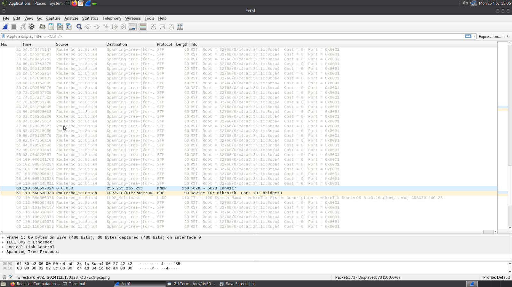

# Steps

## 1
- Execute the command:
`ifconfig eth1 172.16.11.1/24`

- IP
`172.16.11.1`

-MAC
`00:08:54:50:35:0c`

## 2
- Create two bridges
/interface bridge add name=bridge10
/interface bridge add name=bridge11

## 3
- `TUX12` -> `Porta 10`
- `TUX13` -> `Porta 12`
- `TUX14` -> `Porta 14`

```bash
/interface bridge port remove [find interface =ether10]
/interface bridge port remove [find interface =ether12]
/interface bridge port remove [find interface =ether14]
```

```bash
/interface bridge port add bridge=bridge10 interface=ether12
/interface bridge port add bridge=bridge10 interface=ether14
/interface bridge port add bridge=bridge11 interface=ether10
```

## 4 | 5 | 6
```bash
root@tux13:~# ping 172.16.10.254
(...)

root@tux13:~# ping 172.16.11.1
(...)
```


## 7 | 8 | 9

- `TUX13` 
- Execute `ping -b 172.16.10.255`


- `TUX12` 


- `TUX14` 


## 10

- `TUX12` 
- Execute `ping -b 172.16.11.255`


- `TUX13` 



- `TUX14` 

