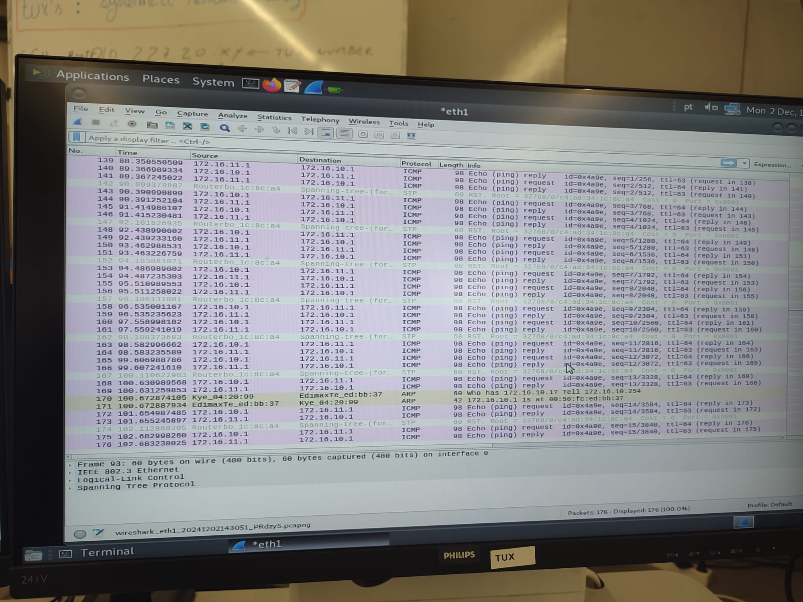
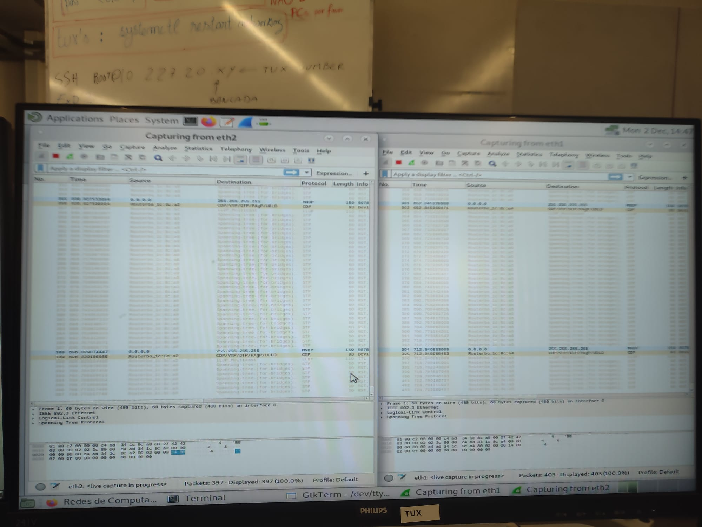
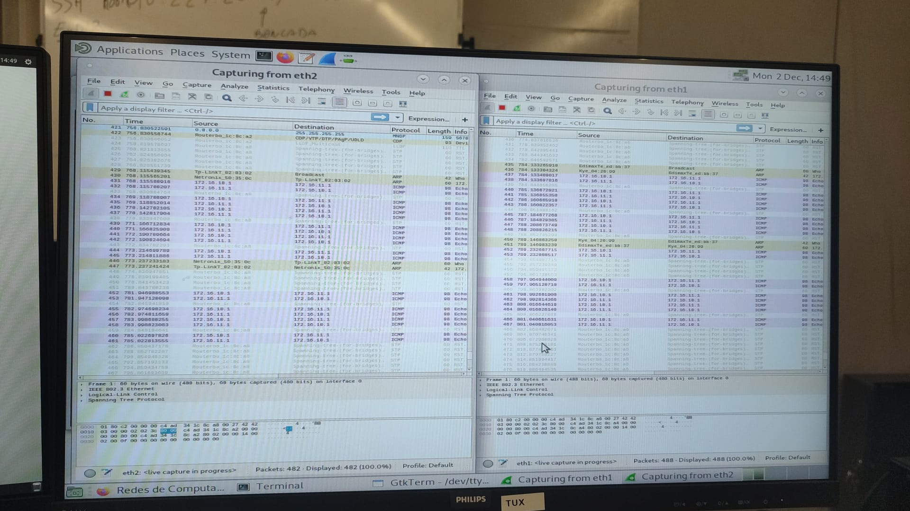

# Steps


## 1

`ifconfig eth2 172.16.11.253/24`
`/interface bridge port remove [find interface =ether16]`
`/interface bridge port add bridge=bridge11 interface=ether16`

Transform tux14 into a router
`sysctl net.ipv4.ip_forward=1`
`sysctl net.ipv4.icmp_echo_ignore_broadcasts=0`


## 2
### ETH1

IP -> `172.16.10.254`\
MAC -> `00:c0:df:04:20:99`

### ETH2

IP -> `172.16.11.253`\
MAC -> `f4:f2:6d:02:03:02`


## 3 | 4
tux12


tux13


## 5 | 6 | 7

```bash
root@tux13:~# ping 172.16.10.254
```


```bash
root@tux13:~# ping 172.16.11.253
```


```bash
root@tux13:~# ping 172.16.11.1
```


## 8
Começar o Wireshark



## 9
Limpar o arp

tux12


tux13


tux14


## 10 | 11
```bash
root@tux13:~# ping 172.16.11.1
```

